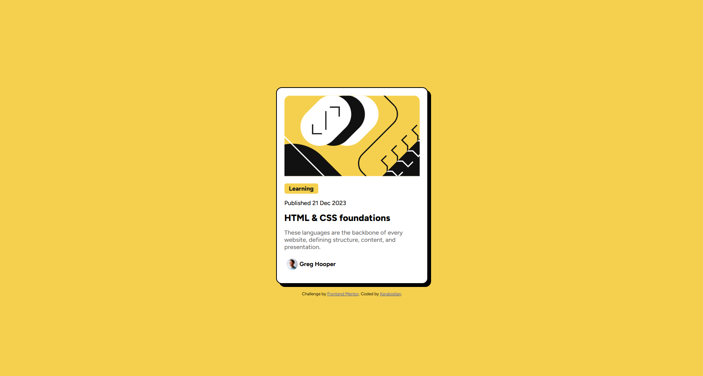

# Frontend Mentor - Blog preview card solution

This is a solution to the [Blog preview card challenge on Frontend Mentor](https://www.frontendmentor.io/challenges/blog-preview-card-ckPaj01IcS). Frontend Mentor challenges help you improve your coding skills by building realistic projects.

## Table of contents

- [Overview](#overview)
  - [Screenshot](#screenshot)
  - [Links](#links)
- [My process](#my-process)
  - [Built with](#built-with)
  - [What I learned](#what-i-learned)
  - [Continued development](#continued-development)
- [Author](#author)

## Overview

### Screenshot

### Links

- Solution URL: https://karabodjan.github.io/frontend-mentor/blog-preview-card-main/

- Live Site URL: https://karabodjan.github.io/frontend-mentor/

### Built with

- Semantic HTML5 markup
- CSS Flexbox
- Google Fonts (Figtree)

### What I learned

- How to create a badge/pill effect using `background-color`, `border-radius`, and `padding`
- How to use `width: fit-content` to make an element shrink to its content width
- How to style a specific child image with `.profil img` without adding extra classes in HTML
- How to use `box-shadow` to create visible card shadows with offset values
- The difference between `font-style` and `font-weight` — bold is a weight, not a style

### Continued development

- Improve understanding of responsive design and media queries
- Practice more with CSS Flexbox and Grid
- Get more comfortable reading and applying design specifications

## Author

- Frontend Mentor - [@Karabodjan](https://www.frontendmentor.io/profile/Karabodjan)
